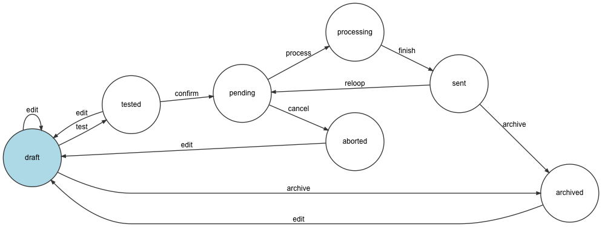

# Novactive eZ Mailing Bundle

Send eZ Contents by email based on the Mailing + Campaign configuration to a group of users (Mailing Lists)

Wording
-------

- Campaign: 
    - A container of Mailing
    - With common metadata like
        - Sender (email and name)
        - Report email
    - Limited by Siteaccess
    - Related to Mailing Lists
    - Associated with Content 
    
- Mailing:
    - A Content to be send
    - A sending date or a frequency

- Mailing List:
    - A container of Users
   
- User:
    - Hold the data of a User (not a eZ User)
    
- Registration:
    - An association of a User and a Mailing List
    
- Broadcast:
    - A record of a Mailing being sent to the Users of the Mailing Lists related to its Campaign
    - Containing the metadata (date, number of recipients etc.)

- A StatHit:
    - A record that tracks
        - email openings
        - clicks on URLs
                       
Features
--------

Nova eZ Mailing allows you to: **Send eZ Contents by email based on the Mailing + Campaign configuration to a group of users (Mailing Lists)** 

At a glance:

- Registration management
    - user information
    - registration and unregistration form (with confirmation email)
    - registration approbation (optional on a Mailing List)

- eZ Platform 2.x Admin UI
    
- Campaign management (CRUD)
    - Mailing (newsletter) management (CRUD)
        - one shot
        - recurrence
    - Mailing List management (CRUD)
    - Statistics and charts (open emails, clicks etc.)
    - Test a Mailing
    
- Users
    - Import into Mailing List
    - Export
    
- Multilingual

- SiteAccess Aware (and SiteAccess Limitations)

- A mailer for the Mailings

- A mailer for the Service Emails

Mailing Workflow
----------------

Here is the possible status changements of a Mailing. 

Usage and installation instructions
-----------------------------------

[Installation](bundle/Resources/doc/INSTALL.md)

[Usage](bundle/Resources/doc/USAGE.md)

Contributing
----------------

[Usage](bundle/Resources/doc/CONTRIBUTING.md)

Change and License
------------------

[Changelog](bundle/Resources/doc/CHANGELOG.md)

[License](LICENSE)

Special Mentions and Credits
----------------------------

- This bundle features are inspired by https://github.com/cjw-network/cjw_newsletter fusionned with eZ Mailing
(and old Novactive bundle neven released in Open Source)
