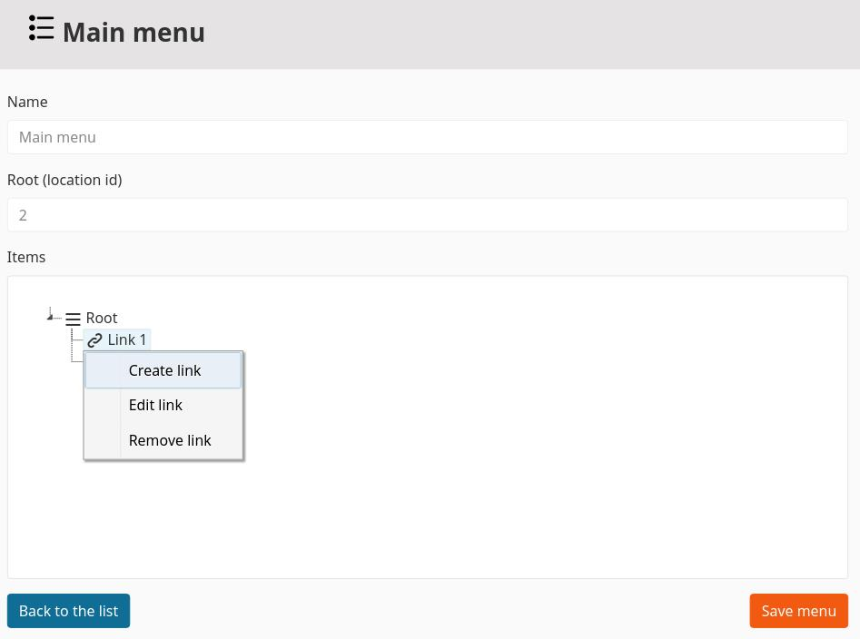

# Novactive eZ Menu Manager Bundle

----

This repository is what we call a "subtree split": a read-only copy of one directory of the main repository. 
It is used by Composer to allow developers to depend on specific bundles.

If you want to report or contribute, you should instead open your issue on the main repository: https://github.com/Novactive/Nova-eZPlatform-Bundles

Documentation is available in this repository via `.md` files but also packaged here: https://novactive.github.io/Nova-eZPlatform-Bundles/master/MenuManagerBundle/README.md.html

----

[](https://packagist.org/packages/novactive/ezmenumanagerbundle)
[](https://github.com/Novactive/NovaeZMenuManagerBundle/releases)
[](LICENSE)

An eZPlatform bundle to let your contributor manage their website menus.
 
## Features

- Admin interface to create/edit/remove a menu
- Manage and organize links from menu edit interface
- Add an ezpublish content to a menu when publishing a content

## Installation

### Use Composer

Add NovaeZMenuManagerBundle in your composer.json:

```bash
composer require novactive/ezmenumanagerbundle
```

### Register the bundle

Register the bundle in the `bundles.php` of your application.

```php
   Novactive\EzMenuManagerBundle\EzMenuManagerBundle::class => [ 'all'=> true ],
```

### Routing config

Add the following routing config

```php
novactive.menu_manager:
    resource: "@EzMenuManagerBundle/Controller/"
    type:     annotation
    prefix:   /
```

### Define menu types

Menu types are defined thougth the following siteaccess aware variable
```yaml
nova_menu_manager.default.menu_types:
    <identifier>: <string or translation key>
```

Exemple 
```yaml
nova_menu_manager.default.menu_types:
    main: menu.type.main
    footer: menu.type.footer
```

## Usage

First create a new menu in the "Menu manager" interface


While editing a menu, you will be able to define the following properties :
* __name__: Name of the menu
* __root (location id)__: This is used to determine the menus availables when publishing a content
* __items__: This is where you can drag&drop, remove, edit and create the menu's links 




Once a menu has been created, you can add the "Menu item" fieldtype to the content types you want to be able to add links to the menus.

Then when publishing a content having the "Menu item" fieldtype, you can select in which menu you want to add a link to the content.


